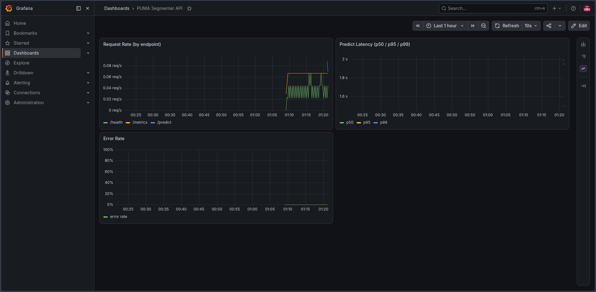

# DINOv2 for Panoptic Pathology 🔬

[](https://puma.grand-challenge.org/)
[](https://github.com/facebookresearch/dinov2)
[](LICENSE)

This repository hosts a technical implementation and study of **Panoptic Segmentation** in digital pathology (Melanoma) using **DINOv2**. The project explores the effectiveness of Self-Supervised Vision Transformers as universal feature extractors for complex clinical diagnostics.

---

## 🏗️ Project Overview

Traditional medical AI pipelines often rely on supervised pre-training on domain-specific data. This project shifts the paradigm by utilizing **DINOv2** (frozen backbone) to validate the "Universal Feature Extractor" hypothesis in the context of the **PUMA Challenge (MICCAI 2024)**.

The task involves simultaneous **Instance Segmentation** (cell nuclei) and **Semantic Segmentation** (tissue architecture), posing a significant challenge in multi-scale spatial reasoning.

### 🎯 Technical Objectives
*   **Feature Probing:** Quantify the generalizability of DINOv2's SSL features on H&E-stained histopathology images.
*   **Panoptic Head Implementation:** Design a lightweight architecture for dual-task segmentation (Micro + Macro) on top of frozen embeddings.
*   **Hardware-Aware MLOps:** Implement an **Offline Feature Caching** pipeline to enable high-resolution training on limited hardware (16GB RAM setups).

---

## 📊 Dataset: PUMA Challenge

We leverage the official **PUMA (Panoptic segmentation of nUclei and tissue in MelanomA)** dataset, which includes:
*   **High-Resolution ROIs:** 1024x1024 pixel patches.
*   **Context ROIs:** 5120x5120 pixel patches for global tissue architecture.
*   **Expert Annotations:** Fine-grained GeoJSON labels for nuclei (instance) and tissue (semantic) classes.

---

## 🏛️ Architecture

Frozen DINOv2 ViT-S/14 backbone + a lightweight trained head (tissue + nuclei segmentation). Full write-up of the architecture decisions, the training pipeline, and a model compression study (validating Chip Huyen's *Designing Machine Learning Systems* against a real CPU-only deployment target) lives in **[ARCHITECTURE.md](ARCHITECTURE.md)**.

The production path serves a **knowledge-distilled student backbone** (16x smaller than DINOv2, 1.3M params) instead of the original — it's the only configuration that meets the deployment's sub-1-second latency budget without sacrificing too much accuracy. See ARCHITECTURE.md, Section 7, for the full comparison across six compression techniques.

---

## 🚀 Running the API

Requires Docker and Docker Compose. The two model checkpoints (`best_linear_probe.pt`, `student_backbone.pt`) are not committed to the repo — they're regeneratable binaries (train via `pipeline/05_train.py`, distill via `optimization/distillation.py`) — so point `PUMA_MODELS_HOST_DIR` at wherever you keep them, or drop them in `./checkpoints/` for the default.

```bash
# from the repo root, with checkpoints in ./checkpoints/
docker compose up -d --build
```

This starts three services:

| Service | Port | What it is |
|---|---|---|
| `api` | `8080` | The FastAPI serving layer |
| `prometheus` | `9090` | Metrics scraping + alerting |
| `grafana` | `3000` | Dashboards (default login `admin` / `admin` — change it) |

## 📡 API Reference

| Method | Route | Description |
|---|---|---|
| `POST` | `/predict` | Multipart image upload → JSON with `tissue_mask_png_base64`, `nuclei_mask_png_base64` (both base64-encoded PNGs), `inference_time_seconds`, and `model`. |
| `GET` | `/health` | `{"status": "ok", "model_loaded": true}` — used by Docker's own healthcheck. |
| `GET` | `/metrics` | Prometheus exposition format — request counts by endpoint/status, latency histogram. |

```bash
curl -X POST http://localhost:8080/predict -F "file=@sample.png"
```

## 📈 Monitoring

Prometheus scrapes `/metrics` every 15s; Grafana is pre-provisioned with a dashboard covering request rate, `/predict` latency (p50/p95/p99), and error rate — no manual setup after `docker compose up`. Two alert rules watch the numbers that actually matter for this project: error rate above 5%, and `/predict` p95 latency breaking the 1s deployment budget.



---

## 📜 Acknowledgments

*   **Meta AI** for the [DINOv2](https://github.com/facebookresearch/dinov2) foundation model.
*   **MICCAI 2024 / PUMA Challenge** organizers for the [dataset and clinical annotations](https://zenodo.org/records/14869398).

---

*Developed as part of an AI Architecture seniority study (O1).*
